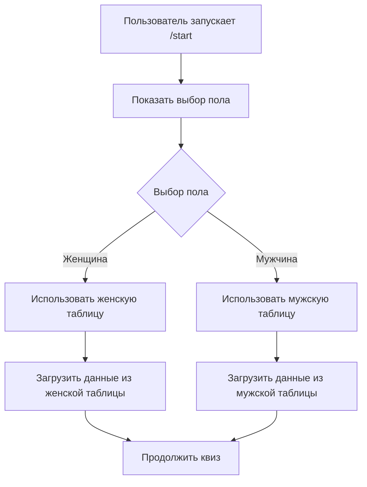
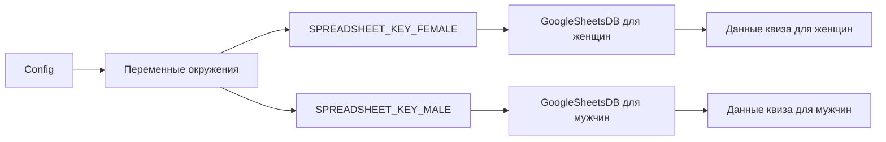

# Дизайн функции выбора пола и использования разных таблиц

## Обзор

Данный дизайн описывает архитектуру для добавления функциональности выбора пола пользователя и использования соответствующих Google Sheets таблиц. Система будет поддерживать две отдельные таблицы: одну для женщин (текущая) и одну для мужчин (новая).

## Архитектура

### Высокоуровневая архитектура



### Архитектура данных



## Компоненты и интерфейсы

### 1. Расширение конфигурации (config.py)

**Новые переменные окружения:**
- `SPREADSHEET_KEY_FEMALE` - ID таблицы для женщин (текущая таблица)
- `SPREADSHEET_KEY_MALE` - ID таблицы для мужчин (новая таблица)
- `SPREADSHEET_KEY` - остается для обратной совместимости, используется как fallback

**Интерфейс:**
```python
# Новые переменные
SPREADSHEET_KEY_FEMALE = os.getenv("SPREADSHEET_KEY_FEMALE", os.getenv("SPREADSHEET_KEY"))
SPREADSHEET_KEY_MALE = os.getenv("SPREADSHEET_KEY_MALE", os.getenv("SPREADSHEET_KEY"))
```

### 2. Расширение GoogleSheetsDB (app/gsheets.py)

**Новый класс GenderBasedSheetsManager:**
```python
class GenderBasedSheetsManager:
    def __init__(self, credentials_json, credentials_path, female_key, male_key):
        self.female_db = GoogleSheetsDB(credentials_json, credentials_path, female_key)
        self.male_db = GoogleSheetsDB(credentials_json, credentials_path, male_key)
    
    def get_db_for_gender(self, gender: str) -> GoogleSheetsDB:
        # Возвращает соответствующую базу данных
```

**Методы для работы с полом:**
- `get_db_for_gender(gender: str)` - возвращает нужную БД
- `validate_gender(gender: str)` - валидация пола
- `get_supported_genders()` - список поддерживаемых полов

### 3. Новые состояния FSM (app/handlers.py)

**Расширение состояний:**
```python
class Introduction(StatesGroup):
    awaiting_gender_selection = State()  # НОВОЕ состояние
    awaiting_promo_confirmation = State()
    awaiting_quiz_start = State()
```

**Данные состояния пользователя:**
- `selected_gender` - выбранный пол ("male"/"female")
- `sheets_db` - экземпляр соответствующей БД

### 4. Новые обработчики (app/handlers.py)

**Обработчик выбора пола:**
```python
@router.callback_query(Introduction.awaiting_gender_selection, F.data.startswith('gender:'))
async def gender_selection_handler(callback_query: CallbackQuery, state: FSMContext)
```

**Модификация start_handler:**
- Добавить показ кнопок выбора пола
- Установить состояние `awaiting_gender_selection`

### 5. Новые клавиатуры (app/keyboards.py)

**Клавиатура выбора пола:**
```python
def generate_gender_selection_keyboard() -> InlineKeyboardMarkup:
    return InlineKeyboardMarkup(inline_keyboard=[
        [InlineKeyboardButton(text="👨 Мужчина", callback_data="gender:male")],
        [InlineKeyboardButton(text="👩 Женщина", callback_data="gender:female")]
    ])
```

## Модели данных

### Состояние пользователя

```python
UserState = {
    "selected_gender": str,  # "male" | "female"
    "sheets_db": GoogleSheetsDB,  # Экземпляр БД для выбранного пола
    "current_question_id": int,
    "scores": Dict[str, int],
    "answered_in_question": List[int],
    "click_count": int,
    "current_answers_order": List[Dict]
}
```

### Конфигурация пола

```python
GenderConfig = {
    "male": {
        "spreadsheet_key": str,
        "display_name": "Мужчина",
        "emoji": "👨"
    },
    "female": {
        "spreadsheet_key": str,
        "display_name": "Женщина", 
        "emoji": "👩"
    }
}
```

## Обработка ошибок

### 1. Отсутствие конфигурации таблицы

**Сценарий:** Не настроен `SPREADSHEET_KEY_MALE`
**Обработка:** 
- Логировать предупреждение
- Использовать женскую таблицу как fallback
- Показать пользователю сообщение о временной недоступности

### 2. Ошибка доступа к таблице

**Сценарий:** Нет доступа к мужской таблице
**Обработка:**
- Логировать ошибку
- Предложить пользователю выбрать женский вариант
- Отправить уведомление администратору

### 3. Некорректный выбор пола

**Сценарий:** Получен неизвестный callback_data
**Обработка:**
- Показать сообщение об ошибке
- Предложить выбрать пол заново
- Логировать инцидент

### 4. Состояние без выбранного пола

**Сценарий:** Пользователь попал в квиз без выбора пола
**Обработка:**
- Перенаправить на выбор пола
- Сбросить текущее состояние
- Использовать женскую таблицу по умолчанию

## Стратегия тестирования

### 1. Модульные тесты

**GenderBasedSheetsManager:**
- Тест инициализации с корректными ключами
- Тест fallback на женскую таблицу при отсутствии мужской
- Тест валидации пола
- Тест получения БД по полу

**Обработчики:**
- Тест выбора мужского пола
- Тест выбора женского пола
- Тест некорректного callback_data
- Тест сброса состояния при повторном /start

### 2. Интеграционные тесты

**Полный флоу для мужчин:**
1. /start → выбор пола → мужчина → промо → инструкции → квиз → результаты

**Полный флоу для женщин:**
1. /start → выбор пола → женщина → промо → инструкции → квиз → результаты

**Тест переключения пола:**
1. Выбор женщины → начало квиза → /start → выбор мужчины → сброс прогресса

### 3. Тесты ошибок

- Недоступность мужской таблицы
- Некорректные данные в таблицах
- Отсутствие интернет-соединения
- Превышение лимитов Google API

### 4. Нагрузочные тесты

- Одновременный выбор пола множеством пользователей
- Переключение между таблицами под нагрузкой
- Кэширование данных из разных таблиц

## Миграция и развертывание

### 1. Подготовка данных

**Создание мужской таблицы:**
1. Скопировать структуру женской таблицы
2. Адаптировать контент для мужской аудитории
3. Настроить права доступа для Service Account
4. Протестировать доступ к новой таблице

### 2. Конфигурация окружения

**Обновление .env:**
```env
# Существующие переменные
SPREADSHEET_KEY=existing_female_table_id  # Для обратной совместимости

# Новые переменные
SPREADSHEET_KEY_FEMALE=existing_female_table_id
SPREADSHEET_KEY_MALE=new_male_table_id
```

### 3. Поэтапное развертывание

**Этап 1:** Развертывание с fallback
- Добавить новый код с fallback на женскую таблицу
- Протестировать работу без мужской таблицы

**Этап 2:** Добавление мужской таблицы
- Настроить `SPREADSHEET_KEY_MALE`
- Протестировать работу с обеими таблицами

**Этап 3:** Мониторинг и оптимизация
- Отслеживать использование разных таблиц
- Оптимизировать кэширование
- Собирать метрики по выбору пола

### 4. План отката

**В случае проблем:**
1. Удалить `SPREADSHEET_KEY_MALE` из окружения
2. Система автоматически вернется к использованию женской таблицы
3. Пользователи смогут продолжить работу без выбора пола

## Безопасность

### 1. Валидация входных данных

- Проверка корректности callback_data для выбора пола
- Валидация состояния пользователя перед обращением к БД
- Санитизация данных из Google Sheets

### 2. Управление доступом

- Отдельные Service Account для разных таблиц (опционально)
- Минимальные права доступа (только чтение)
- Ротация ключей доступа

### 3. Логирование и мониторинг

- Логирование всех выборов пола
- Мониторинг ошибок доступа к таблицам
- Алерты при недоступности таблиц

## Производительность

### 1. Кэширование

- Раздельное кэширование данных из разных таблиц
- Предзагрузка часто используемых данных
- Инвалидация кэша при изменении таблиц

### 2. Оптимизация запросов

- Батчинг запросов к Google Sheets API
- Использование connection pooling
- Асинхронная загрузка данных

### 3. Масштабирование

- Горизонтальное масштабирование бота
- Распределение нагрузки между таблицами
- Мониторинг лимитов Google API