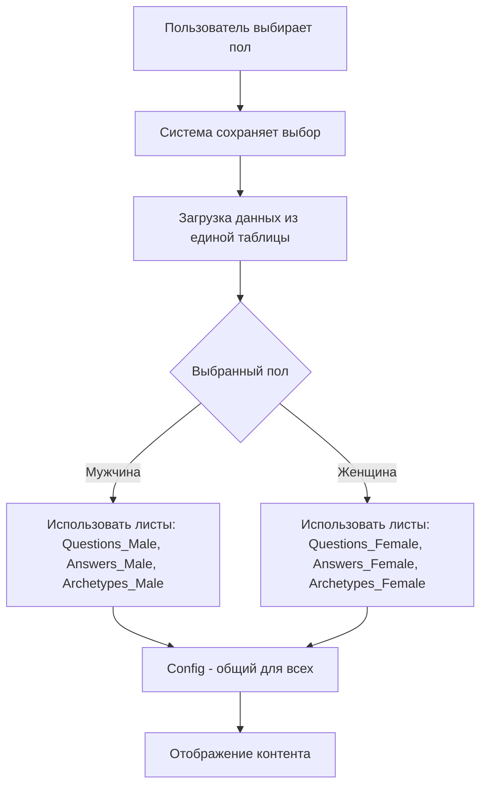
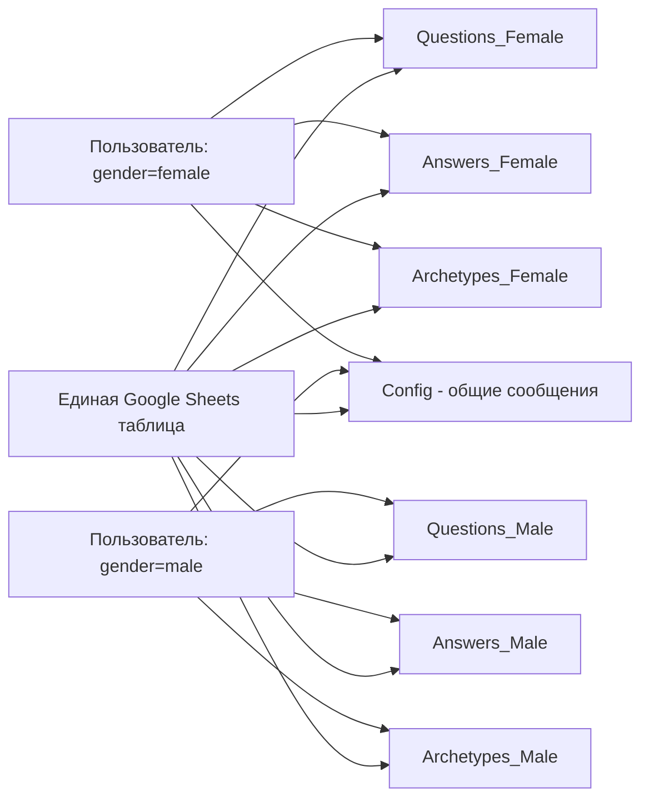

# Дизайн объединения таблиц квиза в одну

## Обзор

Данный дизайн описывает простое объединение двух отдельных таблиц Google Sheets (мужской и женской) в одну таблицу. Цель - упростить управление контентом и иметь единый конфиг для всех сообщений в одном месте. Никакой сложной фильтрации - просто два набора данных в одной таблице.

## Архитектура

### Высокоуровневая архитектура



### Архитектура данных



## Компоненты и интерфейсы

### 1. Новая структура таблицы Google Sheets

#### Лист "Config" (общий для всех)
Содержит общие сообщения для всех пользователей независимо от пола.

| Столбец A | Столбец B |
|-----------|-----------|
| key       | value     |

#### Листы для женщин (существующая структура)
- **Questions_Female** - вопросы для женщин
- **Answers_Female** - ответы для женщин  
- **Archetypes_Female** - архетипы для женщин

#### Листы для мужчин (копия структуры)
- **Questions_Male** - вопросы для мужчин
- **Answers_Male** - ответы для мужчин
- **Archetypes_Male** - архетипы для мужчин

**Структура остается прежней:**

**Questions_Female/Questions_Male:**
| Столбец A    | Столбец B      | Столбец C    |
|--------------|----------------|--------------|
| question_id  | question_text  | prompt_text  |

**Answers_Female/Answers_Male:**
| Столбец A  | Столбец B    | Столбец C    | Столбец D     |
|------------|--------------|--------------|---------------|
| answer_id  | question_id  | answer_text  | archetype_id  |

**Archetypes_Female/Archetypes_Male:**
| Столбец A     | Столбец B         | Столбец C              |
|---------------|-------------------|------------------------|
| archetype_id  | main_description  | secondary_description  |

### 2. Упрощение конфигурации (config.py)

**Удаление старых переменных:**
```python
# Удаляем
# SPREADSHEET_KEY_FEMALE = os.getenv("SPREADSHEET_KEY_FEMALE")
# SPREADSHEET_KEY_MALE = os.getenv("SPREADSHEET_KEY_MALE")

# Оставляем только одну
SPREADSHEET_KEY = os.getenv("SPREADSHEET_KEY")
```

### 3. Упрощенный класс UnifiedGoogleSheetsDB (app/gsheets.py)

**Замена GenderBasedSheetsManager на простой UnifiedGoogleSheetsDB:**

```python
class UnifiedGoogleSheetsDB(GoogleSheetsDB):
    """Простая унифицированная база данных с выбором листов по полу"""
    
    def __init__(self, credentials_path=None, credentials_json=None, spreadsheet_key=None):
        super().__init__(credentials_path, credentials_json, spreadsheet_key)
    
    def _get_sheet_name(self, base_name: str, user_gender: str) -> str:
        """Возвращает название листа в зависимости от пола"""
        if base_name == "Config":
            return "Config"  # Config общий для всех
        
        if user_gender == "male":
            return f"{base_name}_Male"
        else:  # female или fallback
            return f"{base_name}_Female"
    
    def get_question(self, question_id, user_gender="female"):
        """Получить вопрос из соответствующего листа"""
        sheet_name = self._get_sheet_name("Questions", user_gender)
        sheet = self.spreadsheet.worksheet(sheet_name)
        # Остальная логика как в базовом классе
    
    def get_answers(self, question_id, user_gender="female"):
        """Получить ответы из соответствующего листа"""
        sheet_name = self._get_sheet_name("Answers", user_gender)
        sheet = self.spreadsheet.worksheet(sheet_name)
        # Остальная логика как в базовом классе
    
    def get_archetype_result(self, archetype_id, user_gender="female"):
        """Получить архетип из соответствующего листа"""
        sheet_name = self._get_sheet_name("Archetypes", user_gender)
        sheet = self.spreadsheet.worksheet(sheet_name)
        # Остальная логика как в базовом классе
    
    def get_all_archetypes(self, user_gender="female"):
        """Получить все архетипы из соответствующего листа"""
        sheet_name = self._get_sheet_name("Archetypes", user_gender)
        sheet = self.spreadsheet.worksheet(sheet_name)
        # Остальная логика как в базовом классе
```

### 4. Обновление обработчиков (app/handlers.py)

**Простая инициализация БД:**
```python
# Одна БД для всех
sheets_db = UnifiedGoogleSheetsDB(
    credentials_json=config.GOOGLE_CREDENTIALS_JSON,
    credentials_path=config.GOOGLE_CREDENTIALS_PATH,
    spreadsheet_key=config.SPREADSHEET_KEY
)

# В обработчиках просто передаем пол пользователя
async def send_question(callback_query, state, question_id):
    data = await state.get_data()
    user_gender = data.get('selected_gender', 'female')
    
    # Методы автоматически выберут правильный лист
    question = sheets_db.get_question(question_id, user_gender)
    answers = sheets_db.get_answers(question_id, user_gender)
    # ...
```

## Модели данных

### Структура записей (без изменений)

```python
QuestionRecord = {
    "question_id": int,
    "question_text": str,
    "prompt_text": str
}

AnswerRecord = {
    "answer_id": int,
    "question_id": int,
    "answer_text": str,
    "archetype_id": str
}

ArchetypeRecord = {
    "archetype_id": str,
    "main_description": str,
    "secondary_description": str
}
```

### Логика выбора листа

```python
def get_sheet_name(base_name: str, user_gender: str) -> str:
    """Простая логика выбора названия листа"""
    if base_name == "Config":
        return "Config"  # Общий для всех
    
    suffix = "_Male" if user_gender == "male" else "_Female"
    return f"{base_name}{suffix}"
```

## Обработка ошибок

### 1. Отсутствие листа для определенного пола

**Сценарий:** Лист Questions_Male не найден
**Обработка:**
- Логировать ошибку с деталями
- Показать пользователю понятное сообщение об ошибке
- Остановить выполнение операции

### 2. Некорректный пол пользователя

**Сценарий:** user_gender содержит неизвестное значение
**Обработка:**
- Использовать "female" как значение по умолчанию
- Логировать предупреждение
- Продолжить работу с соответствующими листами

### 3. Проблемы доступа к таблице

**Сценарий:** Нет доступа к новой объединенной таблице
**Обработка:**
- Показать понятное сообщение об ошибке
- Логировать детали ошибки для администратора
- При возможности использовать кэшированные данные

## Стратегия тестирования

### 1. Модульные тесты

**UnifiedGoogleSheetsDB:**
- Тест фильтрации по полу для каждого типа данных
- Тест обработки отсутствующего поля gender
- Тест обработки некорректных значений gender
- Тест fallback на "both" при неопределенном поле

**Методы фильтрации:**
- Тест фильтрации вопросов (male, female, both)
- Тест фильтрации ответов с привязкой к вопросам
- Тест фильтрации архетипов
- Тест кэширования отфильтрованных данных

### 2. Интеграционные тесты

**Полный флоу с унифицированной таблицей:**
1. Выбор пола → загрузка отфильтрованных вопросов → прохождение квиза → результаты

**Тест совместимости:**
1. Проверка работы с записями без поля gender
2. Проверка работы со смешанными данными (часть с gender, часть без)

**Тест производительности:**
1. Время загрузки данных с фильтрацией
2. Эффективность кэширования отфильтрованных данных

### 3. Тесты миграции

**Обратная совместимость:**
- Работа со старыми переменными окружения
- Обработка таблиц без поля gender
- Корректное логирование предупреждений

**Валидация данных:**
- Проверка целостности данных после миграции
- Соответствие количества вопросов и ответов
- Корректность связей между таблицами

## Миграция и развертывание

### 1. Подготовка унифицированной таблицы

**Шаг 1: Создание новой таблицы**
1. Создать новую Google Sheets таблицу
2. Скопировать лист Config из любой существующей таблицы
3. Создать листы: Questions_Female, Answers_Female, Archetypes_Female
4. Создать листы: Questions_Male, Answers_Male, Archetypes_Male

**Шаг 2: Копирование данных**
1. Скопировать все данные из женской таблицы в листы *_Female
2. Скопировать все данные из мужской таблицы в листы *_Male
3. Объединить конфиги в один лист Config

**Шаг 3: Проверка данных**
1. Убедиться, что все листы имеют правильные названия
2. Проверить целостность данных в каждом листе
3. Настроить права доступа для Service Account

### 2. Обновление кода

**Этап 1: Добавление новой логики**
```python
# Простая замена GenderBasedSheetsManager на UnifiedGoogleSheetsDB
class UnifiedGoogleSheetsDB(GoogleSheetsDB):
    def __init__(self, ...):
        super().__init__(...)
    
    def _get_sheet_name(self, base_name, user_gender):
        # Простая логика выбора листа
        if base_name == "Config":
            return "Config"
        return f"{base_name}_{'Male' if user_gender == 'male' else 'Female'}"
```

**Этап 2: Простая замена**
1. Заменить GenderBasedSheetsManager на UnifiedGoogleSheetsDB
2. Обновить вызовы методов для передачи user_gender
3. Изменить SPREADSHEET_KEY на новую таблицу

### 3. Конфигурация окружения

**Обновление .env:**
```env
# Новая конфигурация
SPREADSHEET_KEY=unified_table_id

# Старые переменные (для обратной совместимости, с предупреждениями)
# SPREADSHEET_KEY_FEMALE=old_female_table_id  # DEPRECATED
# SPREADSHEET_KEY_MALE=old_male_table_id      # DEPRECATED
```

### 4. План развертывания

**Этап 1: Подготовка (без простоя)**
1. Создать унифицированную таблицу
2. Протестировать доступ к новой таблице
3. Подготовить код с поддержкой обеих архитектур

**Этап 2: Развертывание (с минимальным простоем)**
1. Обновить код на сервере
2. Изменить SPREADSHEET_KEY на новую таблицу
3. Перезапустить бота
4. Мониторить логи на ошибки

**Этап 3: Очистка (через неделю)**
1. Удалить старые переменные окружения
2. Удалить код поддержки старой архитектуры
3. Удалить старые таблицы (после резервного копирования)

### 5. План отката

**В случае проблем:**
1. Вернуть старые переменные SPREADSHEET_KEY_FEMALE/MALE
2. Откатить код до предыдущей версии
3. Перезапустить бота
4. Проанализировать проблемы в логах

## Безопасность

### 1. Простая валидация данных

**Проверка пола пользователя:**
```python
def validate_user_gender(user_gender):
    if user_gender not in ["male", "female"]:
        logging.warning(f"Invalid user gender: {user_gender}, using 'female'")
        return "female"
    return user_gender
```

**Проверка существования листов:**
- Проверка наличия необходимых листов при инициализации
- Fallback на женские листы если мужские недоступны
- Логирование отсутствующих листов

### 2. Управление доступом

**Права доступа к таблице:**
- Минимальные права (только чтение)
- Отдельный Service Account для продакшена
- Регулярная ротация ключей доступа

### 3. Логирование и мониторинг

**Расширенное логирование:**
- Логирование всех операций фильтрации
- Мониторинг производительности запросов
- Алерты при аномальном поведении

## Производительность

### 1. Простое кэширование

**Стратегия кэширования:**
```python
# Кэш работает автоматически для каждого листа отдельно
@cached(cache=TTLCache(maxsize=128, ttl=300))
def get_question(self, question_id, user_gender="female"):
    sheet_name = self._get_sheet_name("Questions", user_gender)
    # Кэш автоматически различает разные листы
    # ...
```

### 2. Оптимизация запросов

**Батчинг операций:**
- Загрузка всех данных одного типа за один запрос
- Фильтрация на стороне приложения
- Предзагрузка часто используемых данных

**Асинхронная обработка:**
- Параллельная загрузка разных типов данных
- Неблокирующие операции с кэшем
- Фоновое обновление кэша

### 3. Мониторинг производительности

**Метрики:**
- Время выполнения запросов к Google Sheets
- Эффективность кэширования (hit rate)
- Количество запросов по типам данных
- Распределение пользователей по полу

**Оптимизация:**
- Настройка TTL кэша на основе реальных данных
- Оптимизация размера кэша
- Предзагрузка популярных данных